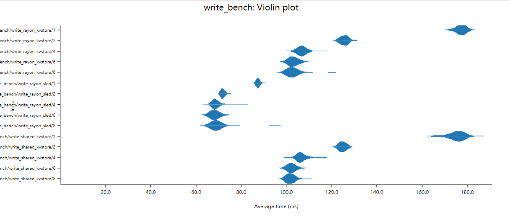
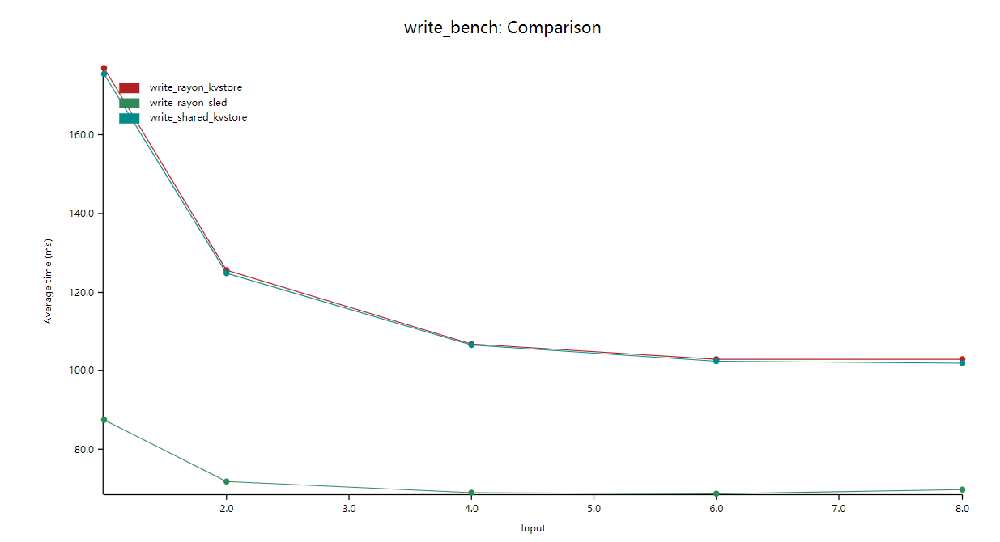
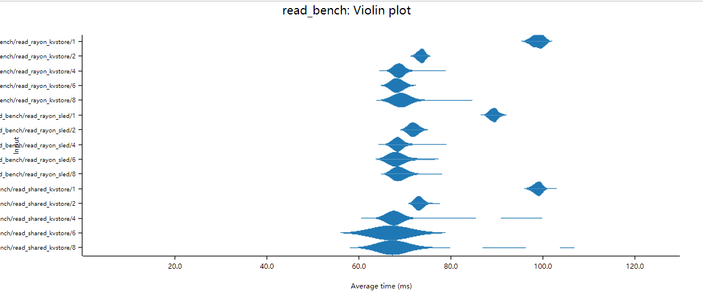
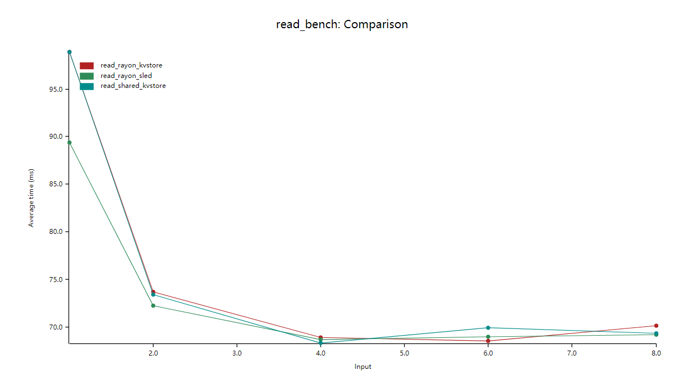

# simple-rust-kvs

My implementation of [PingCAP's PNA Rust Lesson plan](https://github.com/pingcap/talent-plan/blob/master/courses/rust/docs/lesson-plan.md). 

- Project 1
  
  - [x] Build a cli program with clap.
  
- Project 2
  
  - [x] Build a log-structured key-value storage program. Use files to store the data. The implementation is similar to [bitcask](https://github.com/basho/bitcask).
  
- Project 3
  - [x] Create a single-threaded, persistent key/value store server and client with synchronous networking over a custom protocol.
  - [x] Write benchmarks for kvs-engine and sled-engine.

- Project 4

  - [x] Make kvs-engine be able to run in multi-thread.
  - [x] Convert kvs-server to a multi-thread server with a self-made thread pool.
  - [x] Seperate kvs-engine into reader and writer.
  - [x] Make kvs-engine's read lock-free. Use crossbeam-skiplist.
  - [x] Write multi-thread benchmarks.

  
  
  
  
  
  
  
  
- Project 5

  - [x] Turn networking into async with tokio.
  - [x] Add benchmarks for async server (TBD: why the sync results are much different from the old ones).
  - [ ] Turn engine I/O operation into async.

